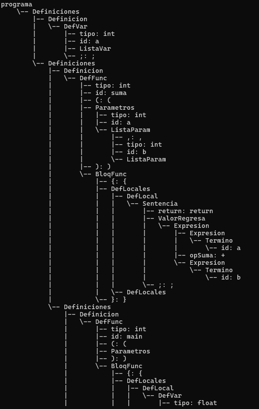

# Árbol Sintáctico LR para un lenguaje tipo C simplificado

Este repositorio muestra la construcción de un **árbol sintáctico** a partir de un análisis **LR** para un lenguaje tipo C simplificado. El objetivo de esta etapa es que el analizador no solo determine si un programa es válido según la gramática, sino que además **genere una representación** de su estructura sintáctica.

El archivo principal de esta entrega es **`arbol_sintactico_lr.py`**, que reutiliza el analizador léxico y la tabla LR construidos en anteriores practicas

---

## Contenido del repositorio

- **`analizadorLexico.py`**  
  Realiza el análisis léxico. Convierte el código fuente en una secuencia de tokens.

- **`parser_lr.py`**  
  Contiene la lógica base para cargar la tabla LR, interpretar reglas y ejecutar las acciones.

- **`compilador.lr`**  
  Archivo que almacena la tabla LR y las producciones de la gramática.

- **`arbol_sintactico_lr.py`**  
  Extiende el análisis sintáctico LR para construir el árbol sintáctico durante el proceso de reducción.

- **`main.cpp`**  
  Archivo de entrada con el programa fuente que será analizado (ejemplo)

- **`Ejemplo.png`**  
  Imagen con la impresión de la ejecución del programa y el árbol sintáctico generado.

---

## Objetivo

En esta etapa del proyecto se busca:

1. Leer un programa fuente desde un archivo.
2. La entrada se obtienen los tokens mediante el analizador léxico.
3. Procesar los tokens con un parser LR.
4. Construir el árbol sintáctico a medida que el parser realiza reducciones.
5. Imprimir el árbol resultante como evidencia del análisis.

Con esto, el proyecto pasa de solamente **validar la gramática** a también **representarlo**.

---

## Ejemplo de entrada

El siguiente código fue utilizado como caso de prueba principal:

```cpp
int a;
int suma(int a, int b){
    return a+b;
}

int main(){
    float a;
    int b;
    int c;
    c = a+b;
    c = suma(8,9);
}
```

---

## Ejemplo de ejecución

La siguiente imagen muestra una ejecución del programa y la impresión del árbol sintáctico:




---

## Funcionamiento general

El flujo del programa se divide en cuatro partes principales.

### 1. Lectura del código fuente

La función `main()` abre el archivo `main.cpp` y carga su contenido en memoria.

### 2. Análisis léxico

El archivo `analizadorLexico.py` procesa la entrada y genera una lista de tokens. Entre los tokens reconocidos se encuentran:

- tipos de dato (`int`, `float`, `void`)
- identificadores
- constantes enteras y reales
- operadores (`+`, `*`, `=`, relacionales, lógicos)
- signos de puntuación (`;`, `,`, `(`, `)`, `{`, `}`)
- palabras reservadas (`if`, `while`, `return`, `else`)

Si aparece un token inválido, el programa reporta error léxico y termina

### 3. Carga de la tabla LR

El archivo `compilador.lr` se carga mediante la función `load_lr_table()` definida en `parser_lr.py`.

Esta tabla contiene:

- las reglas de producción,
- los estados del autómata LR,
- las acciones `shift`, `reduce`, `accept` y `error`,
- y los movimientos `goto` para símbolos no terminales.

### 4. Construcción del árbol sintáctico

La función principal del módulo es:

```python
parse_lr_with_tree(lr, tokens, trace=True)
```

Esta función ejecuta el algoritmo LR y, al mismo tiempo, construye el árbol sintáctico.

---

## Estructuras utilizadas

### Clase `ParseNode`

Representa un nodo del árbol sintáctico.

Cada nodo contiene:

- `symbol`: nombre del símbolo gramatical
- `lexeme`: valor concreto del token si es terminal
- `children`: lista de nodos hijos

Ejemplos de nodos terminales:

- `tipo: int`
- `id: suma`
- `entero: 8`

Ejemplos de nodos no terminales:

- `DefFunc`
- `Expresion`
- `Sentencia`
- `Programa`

La clase también incluye el método `pretty()`, encargado de imprimir el árbol con formato jerárquico.

### Clase `StackEntry`

Representa una entrada de la pila del parser.

Cada elemento de la pila guarda:

- `symbol`: símbolo reconocido
- `state`: estado LR actual
- `node`: nodo sintáctico asociado

Esto permite que la pila no solo almacene estados, sino también la estructura sintáctica parcial construida hasta ese momento.

---

## Construcción del árbol paso a paso

### Acción Shift

Cuando la tabla LR indica una acción positiva, el parser realiza un **desplazamiento**.

En esta fase:

1. identifica el token actual,
2. obtiene su nombre simbólico,
3. crea un nodo terminal,
4. y lo apila junto con el nuevo estado.

Por ejemplo, si el token leído es `int`, el parser crea un nodo como:

```text
tipo: int
```

### Acción Reduce

Cuando la tabla LR indica una reducción, el parser:

1. identifica la regla de producción aplicada,
2. desapila tantos elementos como símbolos tenga el lado derecho de la regla,
3. toma los nodos correspondientes,
4. crea un nuevo nodo con el nombre del lado izquierdo,
5. enlaza los nodos desapilados como hijos,
6. calcula el `goto`,
7. y vuelve a apilar el nuevo nodo.

Así, cada reducción forma una nueva parte del árbol sintáctico.

### Acción Accept

Cuando la tabla indica aceptación, el análisis concluye correctamente y el último nodo sintáctico que permanece en la pila se considera la **raíz del árbol completo**.

---

## Diferencia entre el parser anterior y esta versión

### Parser LR original

La primera versión del parser solamente:

- leía los tokens,
- ejecutaba acciones `shift/reduce`,
- y determinaba si la gramática era aceptada o rechazada.

### árbol sintáctico

- crea nodos terminales en cada `shift`,
- crea nodos no terminales en cada `reduce`,
- conserva la jerarquía entre símbolos,
- y devuelve la raíz del árbol sintáctico al finalizar.


---

## Salida esperada

Si la entrada es válida, el programa mostrará algo equivalente a:

```text
Gramática aceptada

Árbol sintáctico:
...
```

